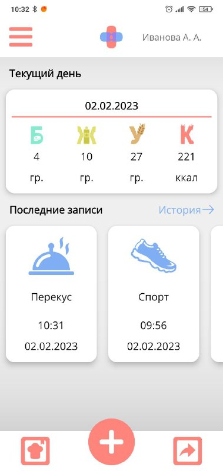
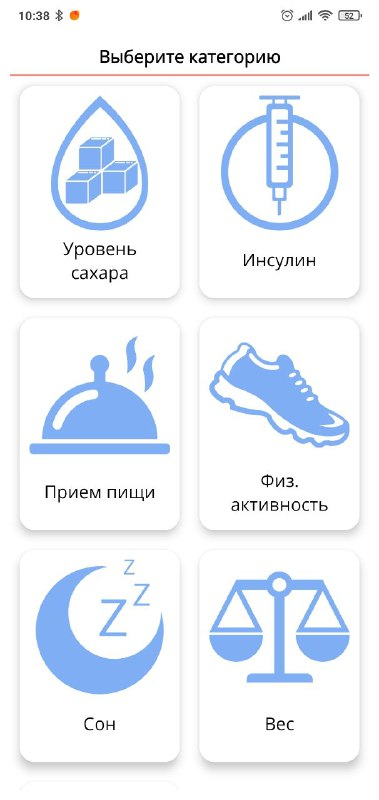
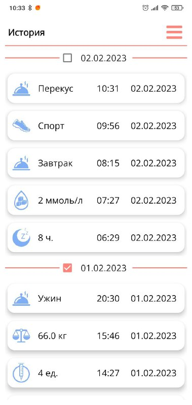
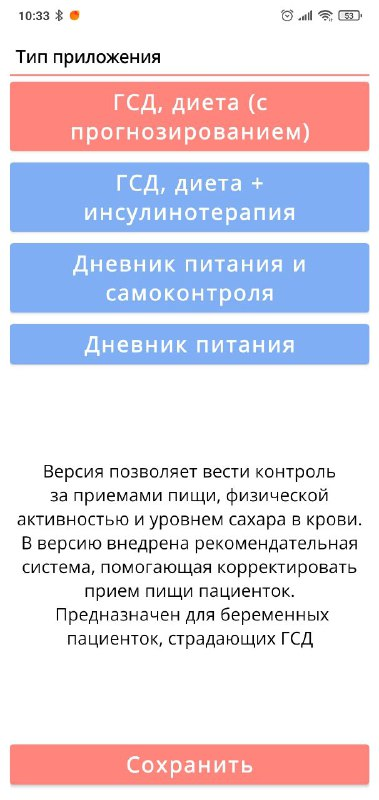
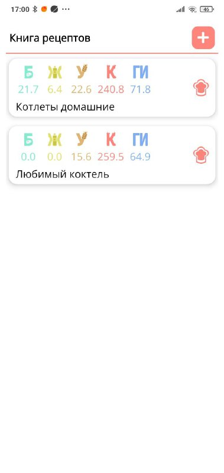

# DIACompanion

## About project

<b>DIA Companion</b> is the Android app for a remote monitoring system for patients with diabetes.

## Features

App presents the following functionality:

- Creating and editing records of meals, blood glucose levels, insulin injections, physical activity, sleep and ketonuria;

- Providing recommendations based on predicted post-meal glucose levels for dietary adjustments;

- Creating recipes for your own meals from the ingredients presented in the database;

- Exporting data as xls spreadsheets for personal review or sending to the doctor;

- Editing the personal data, settings and the type of application.

Four types of application have been developed, which take into account the presence of diabetes and pregnancy among patients. If necessary, the patient can switch to another type of application without losing previously entered data.

The applications feature a recommendation system to help patients with meal selection and portion size during meals. The intelligence of the system is based on two algorithms:

- A neural network model for predicting blood sugar levels after meals, trained on data from patients at the Almazov National Medical Research Centre.

- Algorithm of recommendation formation, which takes into account the sugar level before and after meals, the amount of carbohydrates in the meal, the amount of protein consumed by the patient 6 hours before the meal, the distribution of glycemic load (GL) between foods, their glycemic indexes and the time of the meal.

The recommendation is adjusted in real time, responding to changes made by the user. Color coding and calculated indicators (GL distribution) highlight foods that are recommended to be reduced in volume or excluded from the meal.

To present the information in a convenient form for physicians the patient activity database is converted into an xlsx file with an individual  spreadsheet for each type of activity. In addition to presenting the information in a convenient spreadsheet form, statistical parameters are calculated in the generated tables. Color indication of records, with data exceeding the allowable limits, highlights records of interest to the physician.

Based on an analysis of the patient's records for the past week, an e-mail is generated that contains concise information about the patient's condition and activity. A significance level is also calculated, which allows the physician to quickly identify a patient who needs an urgent consultation.

For patient control in order to avoid getting outliers in the subsequent analysis of the collected data, the actual date of the record and the date indicated in the record itself are being compared.

## Screenshots

  
   

  
   

  
   

